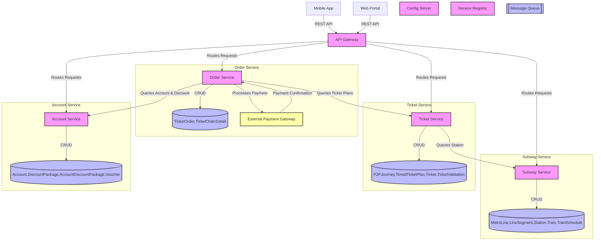

# Metroll

## I. Setup

### 1. Trỏ domain metroll về local

- Windows: Dùng `Win + R`, mở file `C:\Windows\System32\drivers\etc\hosts` thêm dòng này (có thể copy ra ngoài Desktop rồi ghi đè vào thư mục trên)

```
127.0.0.1 api-gateway.metroll
```

- Linux/MacOS: `echo "127.0.0.1 api-gateway.metroll" | sudo tee -a /etc/hosts > /dev/null`

### 2. Thêm Firebase service account

- Lưu file `firebase-service-account.json` vào thư mục `api-gateway/src/main/resources`

### 3. Setup Tool dev (optional)

- Cài Python3
- Chạy file: `dev-tool.bat` (Windows) hoặc `dev-tool.sh` (Linux/MacOS)
- Chạy Docker Desktop hoặc có sẵn remote Docker
- Lựa chọn action:
  + Build (build ra file, không build bằng Docker)
  + Deploy (chuyển file đã build qua Docker và deploy)
  + Build-Deploy
  + Rerun (chạy lại container)
- Lựa chọn container hoặc ALL

### 4. Profiles (optional)
Tạo file `.env` tại thư mục root của project. Sau khi sửa xong, chạy lại container

```properties
SPRING_PROFILES_ACTIVE=dev
```

Toàn bộ service sẽ chạy ở profile `dev` (ngoại trừ Config-Server)

### 5. Spring Configuration (optional)
- Cấu hình các service và profiles đặt chung tại Config-Server ở đường dẫn: `./config-server/src/main/resources/config`
- Tạo profile bằng cách thêm hậu tố như `-dev`, `-stag`. Có hỗ trợ kế thừa từ file base
```
account-service.yml
account-service-dev.yml
```

## II. Development

### 1. API routing
- API đi vào Gateway tại `http://api-gateway.metroll:8080/{service}/{path}` sẽ được route qua `http://{service-address}/{path}` (thường `{service-address}` sẽ là tên container đang chạy service đó)

### 2. Swagger UI
- UI Swagger chung: http://api-gateway.metroll:8080/webjars/swagger-ui/index.html
- UI Swagger riêng, ví dụ của Account-Service: http://api-gateway.metroll:8080/account/swagger-ui/index.html

### 3. Authentication & Authorization
- Authentication và Authorization được thực hiện tại API-Gateway, sau đó từ JWT sẽ extract ra 2 header là `X-User-Id` và `X-User-Role` gửi tới service đích

```
API-Gateway receives:
> Authorization: Bearer <jwt>

Service receives:
> X-User-Id: 99
> X-User-Role: USER
```

---

# Ghi chú khác

| Container        | Domain                   | Port |
|------------------|:-------------------------|------|
| config-server    | config-server.metroll    | 8888 |
| api-gateway      | api-gateway.metroll      | 8080 |
| service-registry | service-registry.metroll | 8761 |

